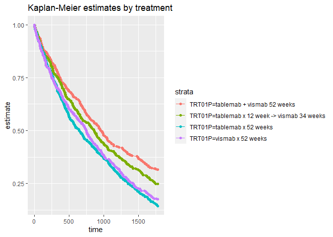

Example Survival data set
================

## The data set and variable definitions

The data set contains the following variables:

  - STUDYID - the study id
  - SUBJID - subject id
  - USUBJID - unique subject id
  - AGE - age at randomisation
  - STR01 - Hormone receptor status
  - STR01N - Hormone receptor positive (Numeric)
  - STR01L - Hormone receptor positive (Long format)
  - STR02 - Prior Radiotherapy at randomisation
  - STR02N - Prior Radiotherapy at randomisation (Numeric)
  - STR02L - Prior Radiotherapy at randomisation (Long format)
  - TRT01P - Planned treatment assigned at randomisation
  - TRT01PN - Planned treatment assigned at randomisation (numeric)
  - PARAM - Analysis parameter
  - PARAMCD - Analysis parameter code
  - AVAL - Analysis value (time)
  - CNSR - Censoring (1 = censored)
  - CNSDTDSC - Event or censoring description
  - DCTREAS - Discontinuation from study reason

## Example analysis

Below is a crude example of how to plot Kaplan-Meier estimates by
treatment.

``` r
ADTTE <- read_csv('2020-04-08-psi-vissig-adtte.csv')
```

    ## Warning: Missing column names filled in: 'X1' [1]

    ## Parsed with column specification:
    ## cols(
    ##   X1 = col_double(),
    ##   STUDYID = col_character(),
    ##   SUBJID = col_double(),
    ##   USUBJID = col_character(),
    ##   AGE = col_double(),
    ##   STR01 = col_character(),
    ##   STR01N = col_double(),
    ##   STR01L = col_character(),
    ##   STR02 = col_character(),
    ##   STR02N = col_double(),
    ##   STR02L = col_character(),
    ##   TRT01P = col_character(),
    ##   TRT01PN = col_double(),
    ##   PARAM = col_character(),
    ##   PARAMCD = col_character(),
    ##   AVAL = col_double(),
    ##   CNSR = col_double(),
    ##   CNSDTDSC = col_character(),
    ##   DCTREAS = col_character()
    ## )

``` r
survfit(Surv(AVAL, CNSR == 1) ~ TRT01P  , data = ADTTE )  %>%
  tidy(fit) %>%
  ggplot(aes(time, estimate, group = strata, colour = strata)) + 
  geom_line() +
  geom_point() +
  ggtitle("Kaplan-Meier estimates by treatment") 
```

<!-- -->
