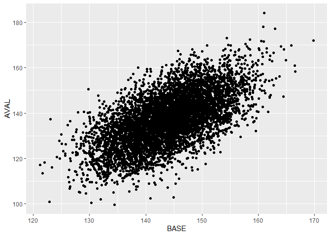

Example meta-analysis dataset
================

# Purpose

The purpose of this webinar is to explore how data visualisation can be
deployed to find
[*insights*](https://www.tandfonline.com/doi/full/10.1080/09332480.2019.1579578)
when faced with [*big
data*](https://github.com/VIS-SIG/Wonderful-Wednesdays/blob/master/data/2020/2020-11-11/BIG_DATA_PSI_WW_DEC2020.csv).

For this webinar, we introduce the challenge of working with pooled or
integrated clinical trial data. This is often referred to as
meta-analysis.

Key issues where data visualisation can help are around the
investigation of whether studies can be combined due to study
heterogeneity among individual trials. This throws up questions such as:

  - What graphical tools can be used to assess heterogeneity, describing
    the fixed and random-effects?
  - what variables are potentially prognostic or predictive of outcome,
    etc?
  - where can graphical methods provide some general recommendations?

# Background

Meta-analysis are a popular approach for summarising a large number of
clinical trials. We can resolving discrepancies raised by individual
these trials, identify new
[*insights*](%5B*insights*%5D\(https://www.tandfonline.com/doi/full/10.1080/09332480.2019.1579578\)),
or attempt to tackle new research questions.

The example simulated data set for this challenge is based on **seven**
phase III studies in Hypertension. The objective of the studies were to
compare the use of intensive hypertensive medicines to control blood
pressure compared to standard of care. The studies are inspired by the
large blood pressure intervention studies such as
[SPRINT](https://biolincc.nhlbi.nih.gov/studies/sprint/).

In this case, instead of a large single trial, we are faced with an
integreted set of seven seperate trials.

# The integrated data

The data set is an abridged version of [CDISC
ADaM](https://www.cdisc.org/standards/foundational/adam).

The data set contains the following key variables for analysis:

  - **STUDYID** Masked study identifer  
  - **USUBJD** Masked subject identifier Identifer
  - **TRT01P** Randomised treatment
  - **AVAL** Mean systolic blood pressure (mm Hg) measured at 1-year
  - **BASE** Mean systolic blood pressure (mm Hg) measured at baseline
  - **CHG** Change from baseline mean systolic blood pressure (SBP) \[mm
    Hg\] at 1-year  
  - **PCHG** Percentage change from baseline mean systolic blood
    pressure (%change) at 1-year
  - **AVALCAT1** Responder analysis - patients with controlled SBP at
    1-Year (\<=120 mmHg) 1 = Yes, 0 = No 1-Year

A wide collection of baseline measurements are also included which can
be explored to understand the patient populations within each trial, to
search for potential subgroups or differential treatment effects, or
even to develop prognostic or predictive risk models.

For a detailed overview of the data set, please refer to the **data
dictionary** section below (or in the file that can be downloaded
[here](DataDictionaryDec2020.xlsx)).

## Outcome - contolled blood pressure at 1-year

The outcome variable **AVAL** is the mean systolic blood pressure (mm
Hg) measured at 1-year. This is an average of three in clinic
measurements. A corresponding measurement taken at baseline **BASE** is
also provided that could be used as a covariate.

Additional potential outcome variables are provided such as the change
score **CHG** and percentage change score **PCHG** between baseline and
1-year.

Other outcomes based around the key outcome measure include a typical
responder analysis to determine how many patients are below the criteria
of Hyptertension (120 mmHG) at 1-year.

## Data Dictionary

In this section is a description of all variables.

| Variable name | Description                                                                                                | Assessment Visit |
| ------------- | ---------------------------------------------------------------------------------------------------------- | ---------------- |
| STUDYID       | Masked study identifer                                                                                     | Identifer        |
| USUBJD        | Masked subject identifier                                                                                  | Identifer        |
| TRT01P        | Randomised treatment                                                                                       | Treatment        |
| TRT01PC       | Randomised treatment (Character)                                                                           | Treatment        |
| TRT01PN       | Randomised treatment (Numeric)                                                                             | Treatment        |
| PARAM         | Analysis variable label                                                                                    | 1-Year           |
| AVAL          | Mean systolic blood pressure (mm Hg) measured at 1-Year                                                    | 1-Year           |
| CHG           | Change from baseline Mean systolic blood pressure (mm Hg)                                                  | 1-Year           |
| PCHG          | Percentage change from baseline Mean systolic blood pressure (%change)                                     | 1-Year           |
| AVALCAT1      | Responder analysis - patients with controlled SBP at 1-Year (\<=120 mmHg) 1 = Yes, 0 = No                  | 1-Year           |
| AVALCAT1N     | Responder analysis - patients with controlled SBP at 1-Year (\<=120 mmHg) 1 = Yes, 0 = No                  | 1-Year           |
| AVALCAT2      | Mean systolic blood pressure (mm Hg) measured at 1-Year categories (\<= 132, 132 - 145, \>= 145)           | 1-Year           |
| AVALCAT2N     | Mean systolic blood pressure (mm Hg) measured at 1-Year categories (numeric) (\<= 132, 132 - 145, \>= 145) | 1-Year           |
| AGE           | Age (years)                                                                                                | Baseline         |
| AGECAT1       | Age Group 3: 75 years and older = TRUE                                                                     | Baseline         |
| AGECAT1C      | Age Group 3: 75 years and older = TRUE                                                                     | Baseline         |
| AGECAT1N      | Age Group 3: 75 years and older = TRUE                                                                     | Baseline         |
| ALBSI         | Albumin (g/L)                                                                                              | Baseline         |
| BASE          | Mean systolic blood pressure (mm Hg) measured at baseline                                                  | Baseline         |
| BASOSI        | Basophils (Absolute) (10E9/L)                                                                              | Baseline         |
| BICARSI       | Bicarbonate (mmol/L)                                                                                       | Baseline         |
| BILISI        | Bilirubin (umol/L)                                                                                         | Baseline         |
| BMI           | BMI                                                                                                        | Baseline         |
| BUNSI         | Blood Urea Nitrogen (mmol/L)                                                                               | Baseline         |
| CASI          | Calcium (mmol/L)                                                                                           | Baseline         |
| CHD10R1       | 10-year Coronary heart disease (CHD) risk category (High (\>20%) , Medium (10-20%), Low (\<10%))           | Baseline         |
| CHD10R1N      | 10-year CHD risk category (Numeric, 1 = Low, 2 = Medium, 3 = High)                                         | Baseline         |
| CHOL\_HDL     | Ratio of Total Cholesterol / HDL                                                                           | Baseline         |
| CHOLSI        | Cholesterol (mmol/L)                                                                                       | Baseline         |
| COUNTRY       | Country indicator                                                                                          | Baseline         |
| CREATSI       | Creatinine (umol/L)                                                                                        | Baseline         |
| EOSLESI       | Eosinophils/Leukocytes (%)                                                                                 | Baseline         |
| EOSSI         | Eosinophils (Absolute) (10E9/L)                                                                            | Baseline         |
| ETHNIC        | Ethnicity                                                                                                  | Baseline         |
| GGTSI         | Gamma Glutamyl Transferase (U/L)                                                                           | Baseline         |
| GLUCPSI       | Glucose, Plasma, Fasting (mmol/L)                                                                          | Baseline         |
| GREGGR1O      | Regional stratification group                                                                              | Baseline         |
| HCT           | Hematocrit                                                                                                 | Baseline         |
| HDLSI         | HDL Cholesterol (mmol/L)                                                                                   | Baseline         |
| HDT           | Phosphate (mmol/L)                                                                                         | Baseline         |
| HEIGHT        | Height (cm)                                                                                                | Baseline         |
| HGBSI         | Hemoglobin (g/L)                                                                                           | Baseline         |
| KSI           | Potassium (mmol/L)                                                                                         | Baseline         |
| LDLSI         | LDL Cholesterol (Assayed) (mmol/L)                                                                         | Baseline         |
| LPASI         | Lipoprotein-A Protein (g/L)                                                                                | Baseline         |
| LYMLESI       | Lymphocytes/Leukocytes (%)                                                                                 | Baseline         |
| LYMSI         | Lymphocytes (Absolute) (10E9/L)                                                                            | Baseline         |
| MONOLSI       | Monocytes/Leukocytes (%)                                                                                   | Baseline         |
| RACE          | Race                                                                                                       | Baseline         |
| SBPCAT1C      | Mean systolic blood pressure (mm Hg) at baseline (Category)                                                | Baseline         |
| SBPCAT1N      | Mean systolic blood pressure (mm Hg) at baseline (Numeric)                                                 | Baseline         |
| SEX           | Sex                                                                                                        | Baseline         |
| TRIGFSI       | Triglycerides (Fasting) (mmol/L)                                                                           | Baseline         |
| URATESI       | Uric Acid (umol/L)                                                                                         | Baseline         |
| WBCSI         | Leukocytes (10E9/L)                                                                                        | Baseline         |
| WEIGHT        | Weight (kg)                                                                                                | Baseline         |

### Downloading data

**NOTE** to download a single data set as a csv file, click on the raw
button and save the
[file](https://raw.githubusercontent.com/VIS-SIG/Wonderful-Wednesdays/dec/data/2020/2020-11-11/BIG_DATA_PSI_WW_DEC2020.csv).
The [following link describes the process in further
detail](https://stackoverflow.com/questions/4604663/download-single-files-from-github).

# Example analysis

This section illustrates a simple example analysis.

## Load data

``` r
library(tidyverse)    
library(broom)
data <- read_csv("BIG_DATA_PSI_WW_DEC2020.csv")
```

## Plot pooled data

Plot the pre-post mean systolic blood pressure of all patients for all
studies.

``` r
data %>% ggplot(aes(x = BASE, y = AVAL)) +
  geom_point()
```

<!-- -->

## Simple analysis by study

A between study comparison of intensive treatment vs standard of care.

``` r
data %>% 
  group_by(STUDYID) %>%
  do(fit = tidy(lm(AVAL ~ BASE + TRT01PN, data = .))) %>% 
  unnest(fit) %>%
  filter(term == "TRT01PN")
```

    ## # A tibble: 7 x 6
    ##   STUDYID term    estimate std.error statistic  p.value
    ##     <dbl> <chr>      <dbl>     <dbl>     <dbl>    <dbl>
    ## 1       1 TRT01PN    -7.12     0.480     -14.8 5.14e-44
    ## 2       2 TRT01PN    -8.17     0.694     -11.8 1.60e-28
    ## 3       3 TRT01PN   -10.1      0.508     -19.8 5.97e-73
    ## 4       4 TRT01PN    -7.27     0.476     -15.3 3.18e-48
    ## 5       5 TRT01PN    -6.97     0.665     -10.5 1.57e-23
    ## 6       6 TRT01PN    -6.80     0.358     -19.0 4.40e-74
    ## 7       7 TRT01PN    -7.74     0.621     -12.5 2.48e-32

Across all studies, there is evidence to suggest intensive treatment
improves blood pressure control (decreases blood pressure) at 1-year
compared to standard of care.
