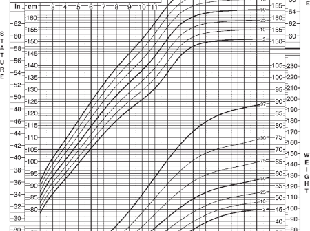

# Assessing a Drug's Impact on Pediatric Growth

## Background

This is a snapshot from a two-year clinical trial assessing the impact of a drug on growth measurements (stature, weight and BMI) in children as part of a regulatory commitment for a marketed drug.  There is a placebo comparator arm that converts to active drug at 6 months and additional rescue medication is allowed.

## Challenge

The purpose of this data visualization is to assess if there is an adverse impact on the growth of these children due to taking the drug (exploratory).  Explanatory examples are welcome too (once you know the answer).

## Data set

The data set can be found [here](PedsGrowths.csv).