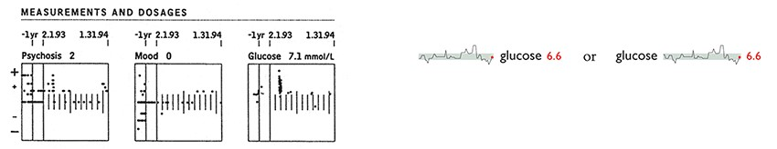
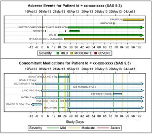
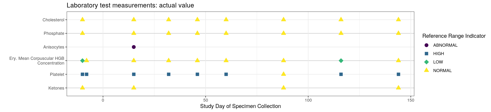

```{r setup, include=FALSE}
knitr::opts_chunk$set(echo = TRUE)
```

# Challenge

The aim of the challenge to to design a visual patient listing or patient profile. 

We are interested in novel ways to present a combination of measurements for an individual patient. For example, how can we combine information on a patients adverse events, lab measurements, medication use, vital signs, etc. We are looking for interesting ways to combine different measurements that provide new insights and help inform study teams. 

The challenge aim is to provide example of how to present individual patient information. In other words, how to best design visualizations that combine measurements at the patient level in an informative manner. 


# Data

We revisit the [Alzheimer data](https://github.com/VIS-SIG/Wonderful-Wednesdays/tree/master/data/2021/2021-11-10) from a previous challenge. The data sets are in ADaM format following the CDISC standard. 

In this challenge we will focus not only on the ADSL (subject level) data but also:  

* ex - patient drug exposure
* adcm - patient con medication records
* adae - patient adverse event records
* adlbc - patient chemistry lab measurements
* adlbh - patient hematology lab measurements
* adlbhy - patient lab measurements - Hy rules.

In this challenge we have filtered the data for an individual patient and stored the files as `.csv`. We provide example data sets as /csv files for a specific patient. For example, [adsl-01-701-1146.csv](adsl-01-701-1146.csv) provides the study demog data for patient 01-701-1146, [adae-01-701-1146.csv](adae-01-701-1146.csv) provides the adverse event information for the same patient, and so on. 

We also provide the original source data as `.xpt` in [data-raw](data-raw/) folder. If you would prefer to select a different patient, there is example code below to illustrate how this can be achieved. 

Documentation summarizing providing an overview over the variables in the data set and also the clinical study can be found in the [data-raw](data-raw/) folder:

* define.pdf is the a description file of the data and analysis
* dataguide.pdf provides a guide of the data set and specifications of each variable
* cdiscpilot01-CSR.pdf is the example clinical study report. 

Note, PHUSE host the original source of the [CDISC pilot data and documents](https://github.com/phuse-org/phuse-scripts/tree/master/data/adam/cdiscpilot01) where additional information can be found.


## Examples of graphical patient profiles

Here are a selection of graphical patient profiles:


```{r tufte, fig.cap = "Tufte's graphical medical profile.", message=FALSE, warning=FALSE}

```

See https://www.edwardtufte.com/bboard/q-and-a-fetch-msg?msg_id=0003mm for more details.

```{r sas, fig.cap = "Developing patient profiles in SAS", label="SAS example", message=FALSE, warning=FALSE}

```

See https://blogs.sas.com/content/graphicallyspeaking/tag/patient-profile/ for more details. 

```{r rpackage, fig.cap = "Producing patient profiles in R with the patientProfilesVis package", label="R example", message=FALSE, warning=FALSE}

```

See https://cran.r-project.org/web/packages/patientProfilesVis/ for more details

# Example code to prepare data for a specific patient

Example code to load, filter and store the patient data for a single patient. Run the code chunk below to save a set of csv files for a specific patient. The unique subject identifier is required. 

```{r prep_data, message=FALSE, warning = FALSE}
library(tidyverse)
library(here)

## source funtion to load, filter and save. 
source(here::here("data/2022/2022-06-08", "get_patient_data.R"))

## Call function to save data as csv files for patient 01-701-1146
get_patient_data(id = "01-701-1146")
```

