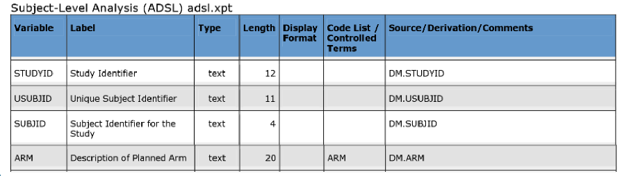
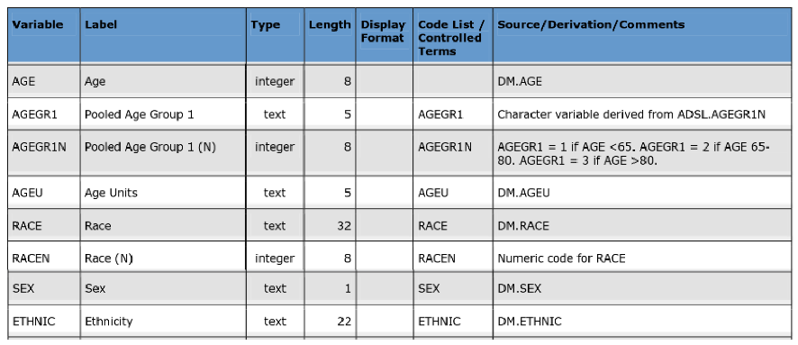
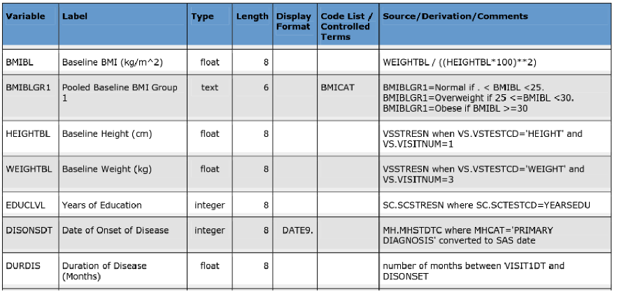

# Gatekeeping Procedure

## Data

The challenge is based on [CDISC data](https://github.com/phuse-org/phuse-scripts/tree/master/data/adam/cdiscpilot01). It is a standard ADSL data set (as .xpt or .csv) for subject level data (demographics and baseline.

  
  
  

## Challenge

- To give a comprehensive visual overview of the demographic data and baseline characteristics
- Highlight outliers and unexpected findings