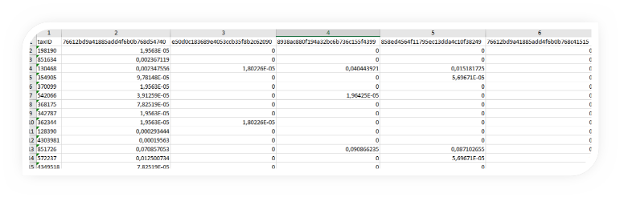
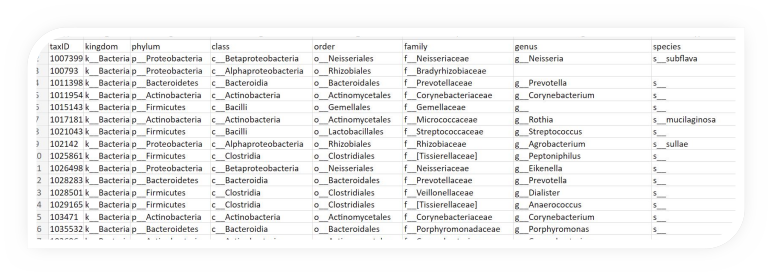
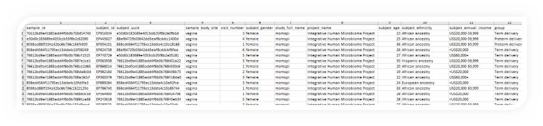

# Microbiome dataset

## Background

- Multi-Omic Microbiome Study:Pregnancy Initiative (MOMS-PI) is part of the longitudinal Human Microbiome Project (HMP)
- MOMS-PI Pre-Term Birth study dataset generated from a case-control study of 194 women predominantly of African ancestry, who delivered spontaneously preterm, and 388 case-matched women who delivered at term.
- Focus on vaginal microbiome profiles from pregnant women.

## The data

### Data set 1

Relative abundance of each microbial community in each woman in pregnancy and the perinatal period

1 row = 1 microbe ; 3,434 microbes  
1 column = 1 sample ; 2,055 samples

The data can be found [here](202402_Collaboration_DataVizESIG-BiomarkersESIG_relative_abundance.csv).

### Data set 2

Taxonomy information of each microbial community

1 row = 1 microbe

The data can be found [here](202402_Collaboration_DataVizESIG-BiomarkersESIG_taxonomy_info.csv).

### Data set 3

Clinical information of each woman (simulated data)

1 row = 1 sample ; 2,055 samples

The data can be found [here](202402_Collaboration_DataVizESIG-BiomarkersESIG_simulated_metadata.csv).

## Challenge

Produce data visualisation(s) providing insights into if the vaginal microbiome profiles can be associated with Pre-Term Birth.

- How do microbiome profiles change over time?
- What are the differences in microbiome profiles between Pre-Term Birth and Term Birth ? 