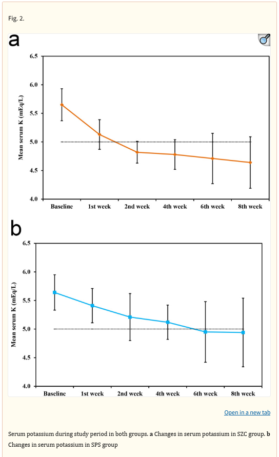

# Hyperkalemia Trial

## The background

The following trial was recently published:
Sodium zirconium cyclosilicate versus sodium polystyrene sulfonate for treatment of hyperkalemia in hemodialysis patients: a randomized clinical trial
The publication is available via [NIH](https://pmc.ncbi.nlm.nih.gov/articles/PMC12054224/) or [BMC Nephrology](https://bmcnephrol.biomedcentral.com/articles/10.1186/s12882-025-04129-9).

## The challenge
Within the publication the below plot was present. This months challenge is to improve the plot or find a better way to visually present the data.

## The data
The data is in the plot and in the publication. There are tools to extract the data. If you're having trouble retrieving the data or you just want to concentrate on the visualisation, make sure to come back here after the third Wednesday of May to find the data [here](https://github.com/VIS-SIG/Wonderful-Wednesdays/blob/master/data/2025/2025-05-14/fig2data.csv).
