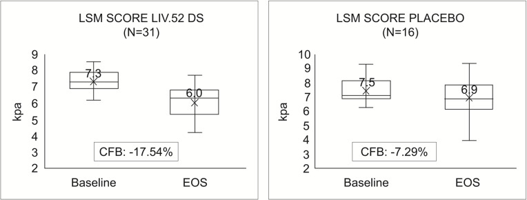
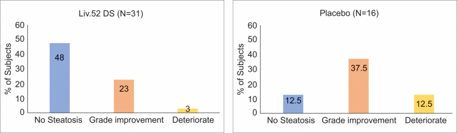

# Fatty liver disease

## The background

There is a recent publication:
The Effect of Liv.52 DS in Metabolic Dysfunction-Associated Fatty Liver Disease (MAFLD): A Pilot, Randomized, Double-Blind, Placebo-Controlled, Clinical Study

The publication is available via [NIH](https://pubmed.ncbi.nlm.nih.gov/40765845/).

## The challenge
Within the publication the below plots were present. This months challenge is to improve a plot or find a better way to visually present the data.

Mean Change in LSM values (kPa). Comparisons between the groups were performed using unpaired t-tests. Data were collected after six months of randomization.

Comparison of Overall Improvement in Steatosis at the end of study.

## The data
The [data](LSM_Score.csv) is derived to match the plotted results in the publication.
