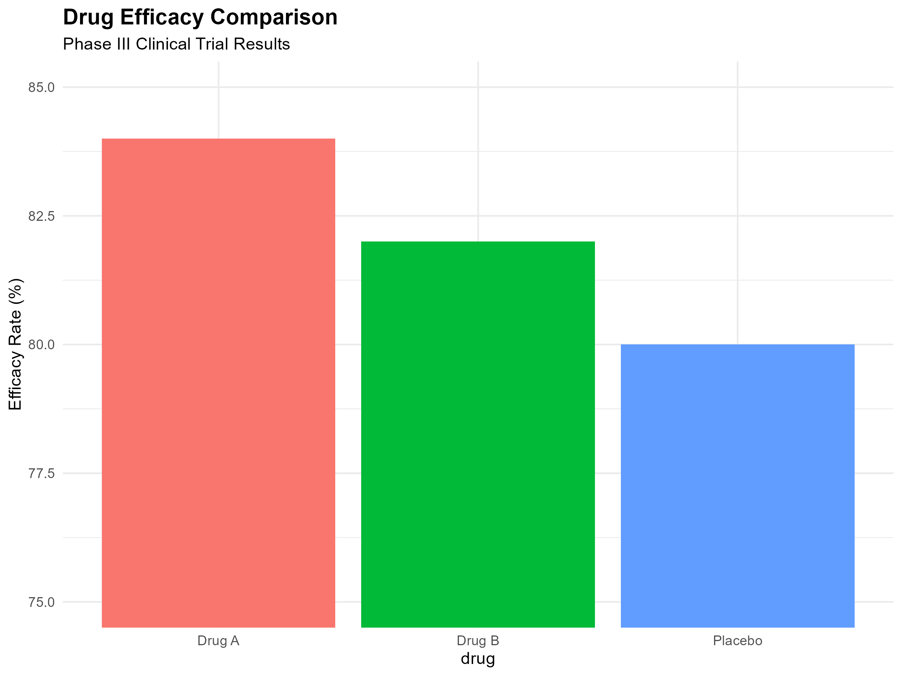
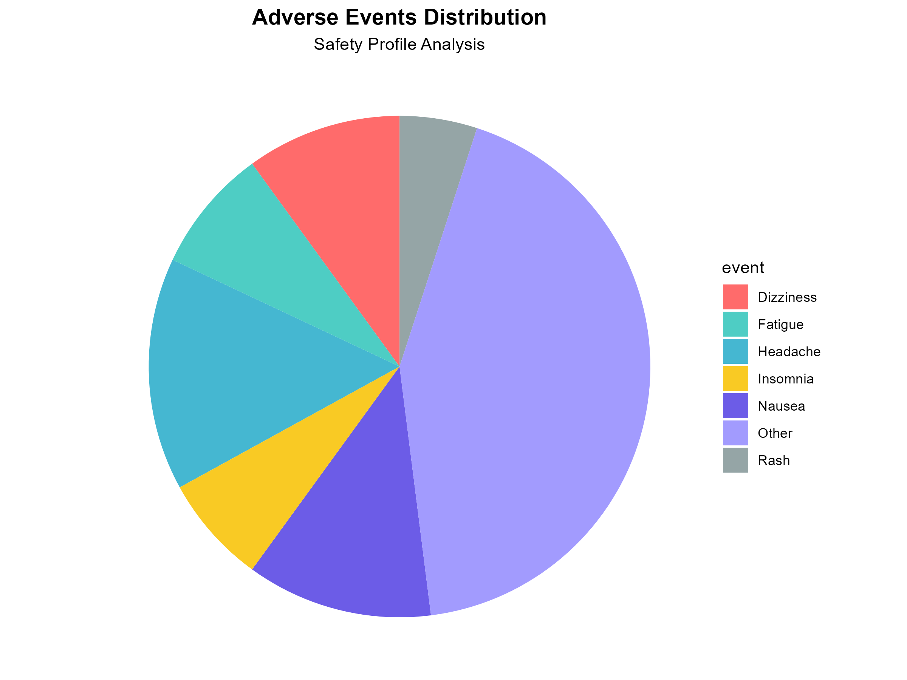
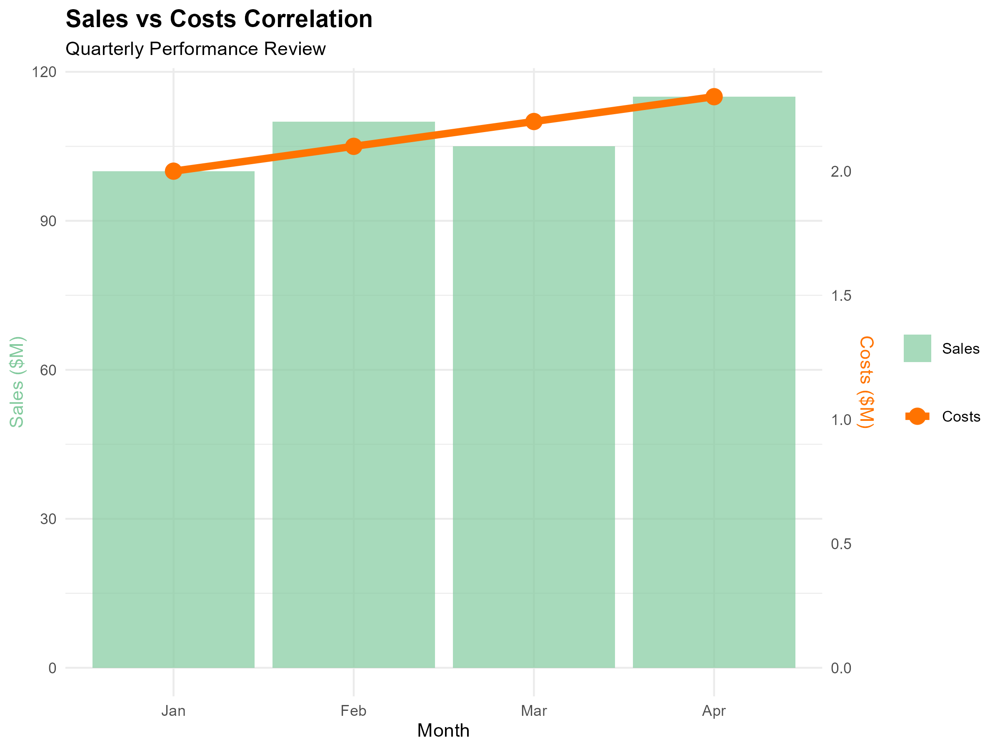
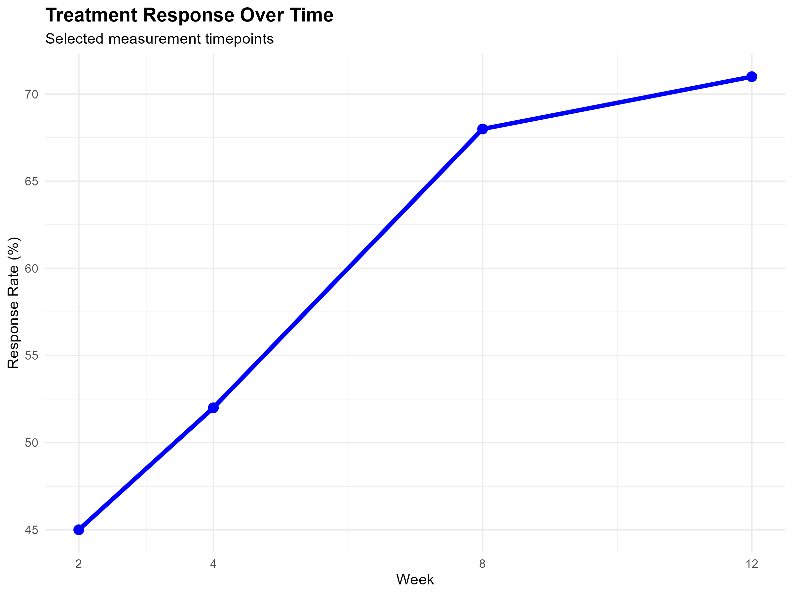
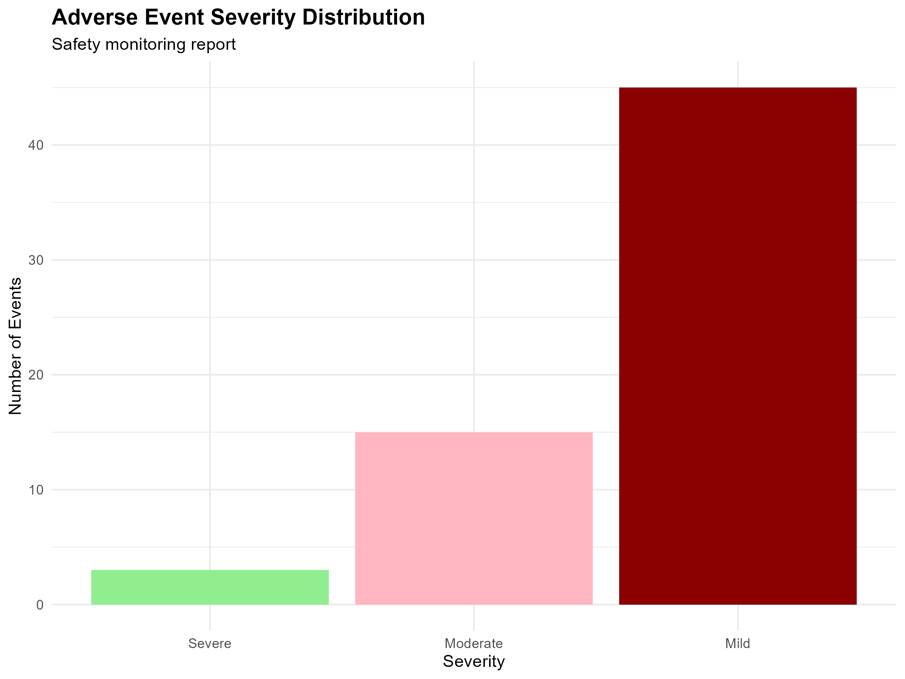

## Overview

**Analyze each visualization and create improved versions.**

Required R packages:

<details>
  
```r
install.packages(c("ggplot2", "gridExtra", "scales"))
```
</details>

---

## Challenge 1: Drug Efficacy Comparison

<details>
  
```r
library(ggplot2)
library(gridExtra)
library(scales)

efficacy_data <- data.frame(
  drug = c("Drug A", "Drug B", "Placebo"),
  efficacy = c(84, 82, 80)
)

p1 <- ggplot(efficacy_data, aes(x = drug, y = efficacy, fill = drug)) +
  geom_bar(stat = "identity") +
  coord_cartesian(ylim = c(75, 85)) +
  labs(title = "Drug Efficacy Comparison",
       subtitle = "Phase III Clinical Trial Results",
       y = "Efficacy Rate (%)") +
  theme_minimal() +
  theme(legend.position = "none",
        plot.title = element_text(face = "bold", size = 14))

```

</details>



The data can be found [here](data/efficacy_data.csv).

---

## Challenge 2: Adverse Events Distribution

<details>

```r
adverse_events <- data.frame(
  event = c("Headache", "Nausea", "Dizziness", "Fatigue",
            "Insomnia", "Rash", "Other"),
  percentage = c(15, 12, 10, 8, 7, 5, 43)
)

pie_colors <- c("#FF6B6B", "#4ECDC4", "#45B7D1", "#F9CA24",
                "#6C5CE7", "#A29BFE", "#95A5A6")

p2 <- ggplot(adverse_events, aes(x = "", y = percentage, fill = event)) +
  geom_bar(stat = "identity", width = 1) +
  coord_polar("y", start = 0) +
  scale_fill_manual(values = pie_colors) +
  labs(title = "Adverse Events Distribution",
       subtitle = "Safety Profile Analysis") +
  theme_void() +
  theme(plot.title = element_text(face = "bold", size = 14, hjust = 0.5),
        plot.subtitle = element_text(hjust = 0.5),
        legend.position = "right")
```

</details>



The data can be found [here](data/adverse_events.csv).


---

## Challenge 3: Sales vs Costs Analysis

<details>

```r
sales_data <- data.frame(
  month = factor(c("Jan", "Feb", "Mar", "Apr"),
                 levels = c("Jan", "Feb", "Mar", "Apr")),
  sales = c(100, 110, 105, 115),
  costs = c(2.0, 2.1, 2.2, 2.3)
)

p3 <- ggplot(sales_data, aes(x = month)) +
  geom_bar(aes(y = sales, fill = "Sales"), stat = "identity", alpha = 0.7) +
  geom_line(aes(y = costs * 50, group = 1, color = "Costs"), size = 2) +
  geom_point(aes(y = costs * 50, color = "Costs"), size = 4) +
  scale_y_continuous(
    name = "Sales ($M)",
    sec.axis = sec_axis(~./50, name = "Costs ($M)")
  ) +
  scale_fill_manual(values = c("Sales" = "#82ca9d")) +
  scale_color_manual(values = c("Costs" = "#ff7300")) +
  labs(title = "Sales vs Costs Correlation",
       subtitle = "Quarterly Performance Review",
       x = "Month") +
  theme_minimal() +
  theme(
    plot.title = element_text(face = "bold", size = 14),
    legend.title = element_blank(),
    axis.title.y.left = element_text(color = "#82ca9d"),
    axis.title.y.right = element_text(color = "#ff7300")
  )
```

</details>



The data can be found [here](data/sales_data.csv).

---

## Challenge 4: Treatment Response Over Time

<details>

```r
trial_data <- data.frame(
week = 1:12,
response = c(40, 45, 44, 52, 50, 48, 55, 68, 65, 66, 69, 71),
se = c(3, 3, 2.5, 3, 2.8, 3.2, 2.9, 2.7, 2.8, 2.6, 2.5, 2.4)
)

p4 <- ggplot(trial_data |> dplyr::filter(week %in%c(2, 4, 8, 12)), aes(x = week, y = response)) +
  geom_line(color = "blue", size = 1.5) +
  geom_point(color = "blue", size = 3) +
  scale_x_continuous(breaks = c(2, 4, 8, 12)) +
  labs(title = "Treatment Response Over Time",
       subtitle = "Selected measurement timepoints",
       x = "Week", y = "Response Rate (%)") +
  theme_minimal() +
  theme(plot.title = element_text(face = "bold", size = 14))
```

</details>



The data can be found [here](data/trial_data.csv).

---

## Challenge 5: Adverse Event Severity

<details>

```r
safety_data <- data.frame(
  category = factor(c("Severe", "Moderate", "Mild"),
                    levels = c("Severe", "Moderate", "Mild")),
  count = c(3, 15, 45)
)

p5 <- ggplot(safety_data, aes(x = category, y = count, fill = category)) +
  geom_bar(stat = "identity") +
  scale_fill_manual(values = c("Severe" = "#90EE90",
                               "Moderate" = "#FFB6C1",
                               "Mild" = "#8B0000")) +
  labs(title = "Adverse Event Severity Distribution",
       subtitle = "Safety monitoring report",
       x = "Severity",
       y = "Number of Events") +
  theme_minimal() +
  theme(legend.position = "none",
        plot.title = element_text(face = "bold", size = 14))
```

</details>



The data can be found [here](data/safety_data.csv).

---


## Your Task

**Analyze each visualization and create improved versions that follow best practices for data presentation.**

Submit your improved charts along with a brief explanation of what you changed and why.
