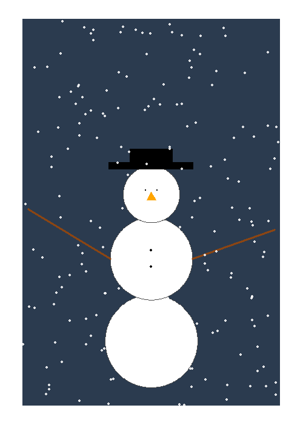

# Seasonal Plots

Time for something different!
Can you create a seasonally-themed image?

## The challenge

* It could be a winter scene or have a Christmas/Hanukkah theme
* Use the concept of layers (e.g. ggplot2) to build an image
* Can be static or animated
* Can use AI tools (e.g. Claude/ChatGPT) to develop code using a series of prompts

We will review coding tips and techniques from submitted entries

