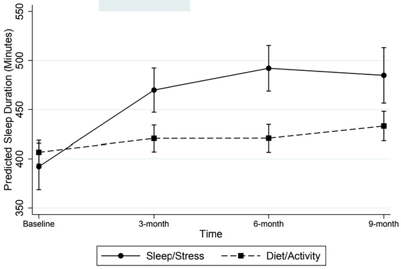
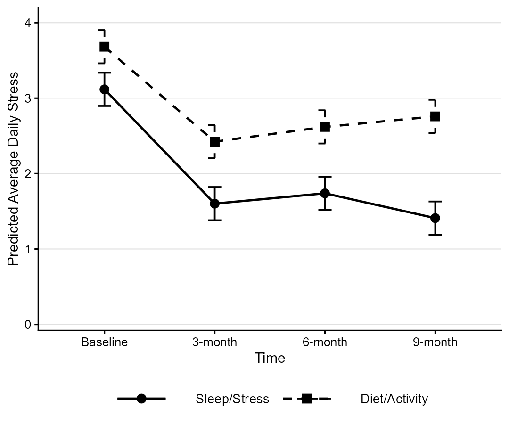
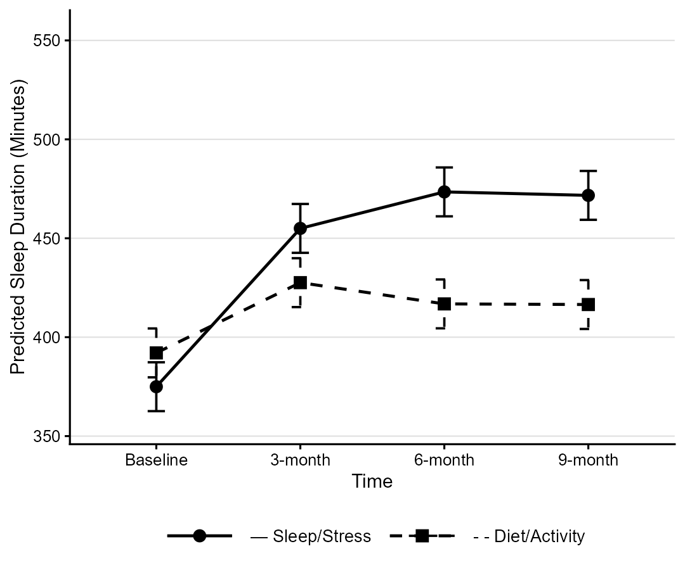

# Make better choices
## The background

There is a recent publication:
Behavior change intervention targeting physical activity and diet improves stress and sleep

It describes the results of the Make better choices 2 trial.

The publication is available via [PubMed](https://pubmed.ncbi.nlm.nih.gov/41770781/).

## The challenge

Find or create a better or more suitable plot than the one provided in the publication. 

Fig 1. Predicted average daily stress (+/-95% CI) across time as a function of intervention type

Fig 2. Predicted Mean (+/-95% CI) Sleep Duration Across Time as a Function of Intervention Type 

## The data

The original data is not available. Simulated data is available for [download](../2026-03-11/simulated_MBC2_data.csv). The R code used for simulating the data may be found on our [github page](https://github.com/VIS-SIG/Wonderful-Wednesdays/blob/master/data/2026/2026-03-11/simulate_MBC2.R).

The two original plots shown above have been redone with the simulated data:

Fig 1 (simulated). Predicted average daily stress (+/-95% CI) across time as a function of intervention type

Fig 2 (simulated). Predicted Mean (+/-95% CI) Sleep Duration Across Time as a Function of Intervention Type 

