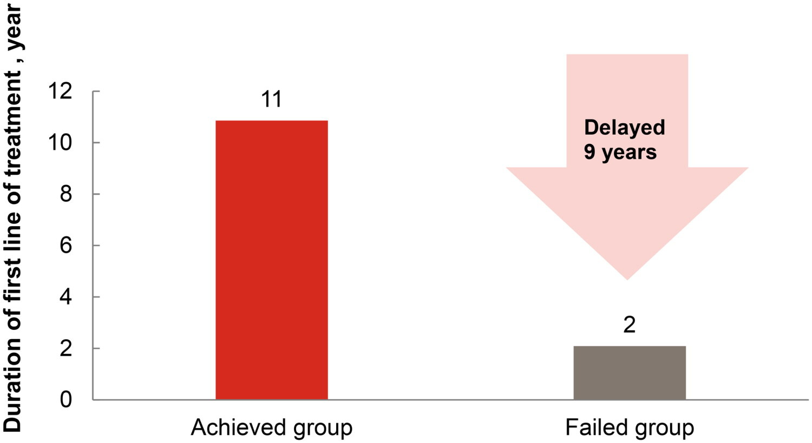

# Glycemic control
## The background

Type 2 diabetes (T2D) is a growing health challenge in China, where many patients struggle to manage their blood sugar and weight effectively. This study looked at the long-term health and cost benefits of achieving three treatment goals: blood sugar control, weight loss, and avoiding low blood sugar episodes. Using a UK Prospective Diabetes Study Outcomes Model Version 2 (UKPDS OM2) based on patient data from a clinical trial recruiting predominantly Chinese adults with T2D, researchers found that patients who met these goals for several years had fewer diabetes-related complications, lived longer, and had better quality of life. They also saved money on healthcare costs—up to ¥53,234 per person over 30 years. The longer patients maintained these goals, the greater the benefits. These findings support the importance of achieving and maintaining treatment targets to improve health outcomes and reduce costs for people with T2D in China.

The recent publication is available via [Taylor and Francis](https://doi.org/10.1080/13696998.2025.2604454).

## The challenge

Identify alternative design choices for the plot below to convey the main conclusion from the study results. Or you may create a new plot.

Fig 1. Duration of first line of treatment for the Achieved group and Failed group in CTT 1 (base case) when the CTT sustained for 10 years. Abbreviation. CTT, composite treatment target

This was originally figure 3 in the publication. 

## The data

There is no addidtional data needed for this challenge. If you want to add more information to the plot you may download the original data as available from the publication (download as CSV possible). 
